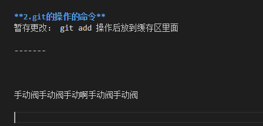

项目开发中git是非常重要的，它可以有效、高速地处理从很小到非常大的项目版本管理。
<!--more-->

## 资料：

- 廖雪峰git教程： https://www.liaoxuefeng.com/wiki/896043488029600
- git 笔记： https://github.com/Zhangguoliu/learn-git/blob/master/learngit-note.md
- git 教程： https://git-scm.com/book/zh/v2/Git-基础-总结
- git 命令的理解： https://www.yiibai.com/git/git_fetch.html 
- git 在线学习： https://learngitbranching.js.org/?demo
- 了解git flow 协作开发理念 : https://www.cnblogs.com/cnblogsfans/p/5075073.html

<!-- - 了解hzero开发git规范： http://hzerodoc.saas.hand-china.com/zh/docs/development-specification/basic/branch-management/ -->

## 项目开发常用命令
可以设置当前厂库的 用户和邮箱
```js
git config --local user.name 'xxx';

git config --local user.email 'xxx';
```

设置全局的仓库大的用户名和邮箱
```js 
git config --global user.name 'xxx'; 

git config --global user.email 'xxx';
```
> 在github提交代码后如果贡献如果没有被记录，有可能就是你全局或者当前的git仓库的用户名和邮箱不是github的用户名和邮箱。

如果这个命名存在也可以直接覆盖修改,还可以替换git config中已有的邮箱
```git
$  git config --global --replace-all user.email "输入你的邮箱"
$  git config --global --replace-all user.name "输入你的用户名"
```

保存密码： 如果没有设置ssh 可以通过保存密码的方式来跳过输入密码这个步骤
```
git config credential.helper store
```
- git stash: https://www.cnblogs.com/zndxall/archive/2018/09/04/9586088.html
- 本地主分支 : `origin/HEAD -> origin/master`  表示默认分支

- 查看提交详细信息: `git show`

- `git  status` ：命令用于显示工作目录和暂存区的状态。使用此命令能看到那些修改被暂存到了, 哪些没有, 哪些文件没有被`Git tracked`到。`git status`不显示已经`commit`到项目历史中去的信息。 一般红色的没有被追踪到，绿色的是已经add后的， 意思就是被追踪了
- 克隆指定分支下的内容: `clone -b brandName url`
- 参看所有分支： `git branch -a 会列出当前库所有的分支（本地、远程）`
- 切换分支： `git checkout branchName` 加上 -b 参数会新建并切换到该分支 `git checkout -b branchName`
- 创建分支：`git brahch branchName`
- 删除分支：`git branch --delete branchName`
- 删除远程分支： `git push --delete origin branchName`
- 删除那些远程仓库不存在的分支: `git remote prune origin`
- 查看本地分支与远程分支的对应关系： `git remote show origin`

通过这个命令可以看出 本地分支与远程分支的对应关系，是否与远程有对应关系。

`Local branches configured for 'git pull'`:表示本地分支 从哪个远程分支拉取

`Local branches configured for 'git pull'`:表示本地分支 推送到哪个远程分支上去

### git 常用命令理解

#### git fetch

将某个远程主机的更新 `git fetch <远程主机名>` 若要更新所有分支，命令可以简写为： `git fetch`

上面命令将某个远程主机的更新，全部取回本地。默认情况下，git fetch取回所有分支的更新。如果只想取回特定分支的更新，可以指定分支名,如下所示: `git fetch <远程主机名> <分支名>`

比如，取回origin主机的master分支： `git fetch origin master`

所取回的更新，在本地主机上要用**远程主机名/分支名**的形式读取。比如origin主机的master分支，就可以用`origin/master`读取。

git branch命令的-r选项，可以用来查看远程分支，-a选项查看所有分支。
```cmd
$ git branch -r
origin/master

$ git branch -a
* master
  remotes/origin/master
```
上面命令表示，本地主机的当前分支是master，远程分支是`origin/master`。取回远程主机的更新以后，可以在它的基础上，使用`git checkout`命令创建一个新的分支。

#### 常见分支操作 -新建分支
##### 情况1 ： 
如果远程新建了一个分支，本地没有该分支，可以用 `git checkout --track origin/branch_name`

这时候本地会新建一个分支名叫`branch_name`，会自动跟踪（track）远程的同名分支branch_name（就可以在这个本地分支上推拉代码）

用上面中方法，得到的分支名永远和远程的分支名一样，如果想新建一个本地分支不同名字，同时跟踪一个远程分支可以利用。
`git checkout -b new_branch_name branch_name`

这条指令本来是根据一个`branch_name`分支分出一个本地分支`new_branch_name`，但是如果所根据的分支`branch_name`是一个远程分支名，那么本地的分支会自动的`track`远程分支。

>注意：一般用`git push --set-upstream origin branch_name`来在远程创建一个与本地`branch_name`同名的分支并跟踪；利用`git checkout --track origin/branch_name`来在本地创建一个与`branch_name`同名分支跟踪远程分支.

当使用`git checkout -b new_branch_name origin/branch_name`当提交的时候会报这个错：
```
fatal: The upstream branch of your current branch does not match
the name of your current branch.  To push to the upstream branch
on the remote, use

    git push origin HEAD:master

To push to the branch of the same name on the remote, use

    git push origin dev-test
```
这是由于`Git`中`push.default`的设置的原因

`Git`中`push.default`可以指定在没有明确指定远程分支的情况下，默认push的远程分支，其取值可以是：

- `nothing` - `push` 操作无效，除非显式指定远程分支（意思就是 push的时候 必须指定远程的分支）
- `current` - `push` 当前分支到远程**同名**分支，如果远程同名分支不存在则自动创建同名分支（`central 和 non-central workflows`都适用）
- `upstream` - `push` 当前分支到它的`upstream`分支上（通常用于`central workflow`）
- `simple` - `simple`和`upstream`是相似的（通常用于`central workflow`），只有一点不同，`simple`必须保证本地分支和它的远程`upstream`分支同名，否则会拒绝`push`操作
- `matching` - `push`所有本地和远程两端都存在的同名分支

- `central / non-central workflows` 是`Git`的两种常见工作流场景：
    1. `central workflows` - 集中式工作流，一个分支的`push`和`pull`都是同一个远程仓库
    2. `non-central workflows` - 非集中式工作流，一个分支的`push`和`pull`可能分别都有不同的远程仓库

> 在Git 2.0之前，push.default的内建值被设为'matching'，2.0之后则被更改为了'simple'。


通过`git remote show origin`可以看到每个分支的具体信息: (例如 `git checkout -b local origin/daily/dev`)
```
 Local branches configured for 'git pull':
     local merges with remote /daily/dev
     master       merges with remote master
  Local ref configured for 'git push':
    master pushes to master (up to date)
```
由于`git checkout -b local origin/daily/dev`会自动创建远程分支`/daily/dev` 和本地分支local的跟踪关系。
其中`Local branches configured for 'git pull'`:下的就是`upstream`跟踪分支。

可以看出，远程分支`/daily/dev`和本地分支`local`建立了`git pull`的关系，但是没有建立`git push`的关系。此时如果强行push，不会成功，会出现如下提示：
```
fatal: The current branch new has no upstream branch.  
To push the current branch and set the remote as upstream, use
    git push --set-upstream origin develop
```
这种提示的处理方式下面会给出具体的处理方法。

##### 情况2 ：
本地新建分支，然后推送到远程，可以使用`git branch branch_name`或者`git checkout -b branch_name`(新建并切换到该分支) 新建一个本地分支,然后修改了代码 执行add 、commit、最后执行push操作 发现会发现报错：
```
# git push 
fatal: The current branch make-scripts-executable has no upstream branch.
To push the current branch and set the remote as upstream, use

    git push --set-upstream origin branch_name
```
这是因为Git不知道你要提交到哪个分支上去, 所以需要你指定提交的分支, 直接从本地检出的新分支，第一次push，远程仓库还没有与之建立tracing关系的分支，所以需要设置upstream，这个设置一次之后，后面再push的时候就不用设置了。

如果不想这样写则需要指定提交到远程的分支： `git push origin branch_name`。

`git push origin branch_name`推向制定的分支，最强暴的方法。但是每次提交都要指定，太麻烦了（而且还容易出错）。所以需要与远程分支关联。

所以使用`git push --set-upstream origin branch_name`远程分支关联。 这样就不用每次push的时候都指定分支了，都会提交到关联的远程分支上去。(branch_name是远程分支名)


#### 常见分支操作 合并分支
`git merge`命令用于将两个或两个以上的开发历史加入(合并)一起。 将 merge 后面的分支合并到当前分支。

+ 将分支dev合并到当前分支中，自动进行新的提交：
```
git merge dev
```

+ 合并分支 branch1 和 branch2 在当前分支的顶部，使它们合并：
```
git merge branch1 branch2
```
+ 合并branch1分支到当前分支，使用ours合并策略：
```
git merge -s ours branch1
```
+ 将分支branch1合并到当前分支中，但不要自动进行新的提交：
```
git merge --no-commit branch1
```
#### Git checkout [文件名]、git reset HEAD [文件名] 、git reset [哈希值] 的应用场景。
##### git reset HEAD [文件名]


通过git reset [文件名] 可以将暂存区的文件放出来 ， 但是我们的工作区的内容没有改变。只是相当于 对[文件名] 不执行 git add 操作 。 类似于后退操作。

#### git checkout [文件名]
工作区回退：如果比对后，发现这次改动不是我们想要的，那么我们可以回退到未修改之前，（在vsCode等编辑器里面，可以放弃修改）
```
git checkout readme.txt
git checkout .
git checkout -- readme.txt  // 以防判断成分支
```


下面这串数字是我们新加的, 通过git status 我们可以看到readme.md文件做了修改


使用 git checkout [文件名] 可以将它变成修改前的是 ，意思就是放弃本次修改。 执行改命令后，发现添加的数字不见了 
git status 显示文件没有修改。


如果我们已经添加到了暂存区（意思已经执行 `git add` 操作了），如果要退回到修改前，我们应该怎么处理呢。

直接通过`git checkout [文件名]`是不能将它回退到未修改的样子的。可以先采用`git reset HEAD [文件名]` 将它移除暂存区（意思就是回退在没有执行`git add` 的时候）, 然后通过`git checkout [文件名]` 将改文件退回到修改前。

#### git reset [哈希值]
上面的操作都是在暂存区 ，还没有使用git commit 提交到本地厂库 。如果已经提交到本地厂库了又要如何操作呢。

将readme.md文件添加一段文字, 然后提交到本地的厂库。



通过`git reflog `可以看到一共有两个版本  当前的版本是`HEAD -> master`


然后 在修改文件`readme.md`，然后在提交到本地厂库。


但是这个时候的需求是 **回到没有添加第二次提交文字**的时候，意思就是要回到上一个版本。

可以通过使用 `git reset` 的命令来完成。基本的流程是执行：`git reset --mixed HEAD^ `意思就是回退到上一个版本。


可以发现命令成功了，是不是页面也变成了原来的样子呢，然后并没有改变。那这个命令具体做了什么呢?

我们通过看`readme.md`和`git status`看可以看到


是将它回退没有执行`git add`命令之前了，相当于你修改了代码 但是没有提交的那个状态。然后可以通过`git checkout readme.md` 命令将它变回未修改的状态。

但是如果我们要从现在没有添加那个文字的这个版本  变到添加了文字的版本 要如何操作呢。

通过`git reflog` 可以看出当前的版本是`fd8258e`


我们使用 `git reset --hard HEAD^`, 发现这里readme.md文件直接被修改了。


   
 同时版本并灭有从`fd8258e` 变到 `a5da32e` 而是变到了`df0abb9`，这里的原因是git的提交是一条时间线，在这条时间线上，`fd82582`的上一次提交就是`df0abb9`


如果要变成指定的版本应该采用命令： `git reset [哈希值]； --mixed 为默认参数`。


显示readme.md被修改了，通过左右两边的比较可以发现。 左边相当于原文件，而右边相当于对原文件的修改。可以通过 `git checkout readme.md `放弃本次修改。


执行`git checkout readme.md`页面变成了修改之前的，同时也可以使用`git statsu`看出没有做出修改。


